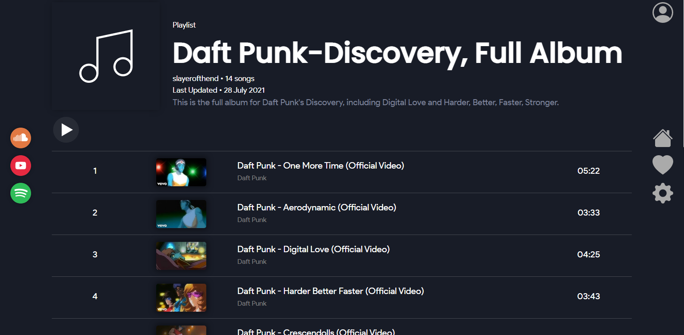
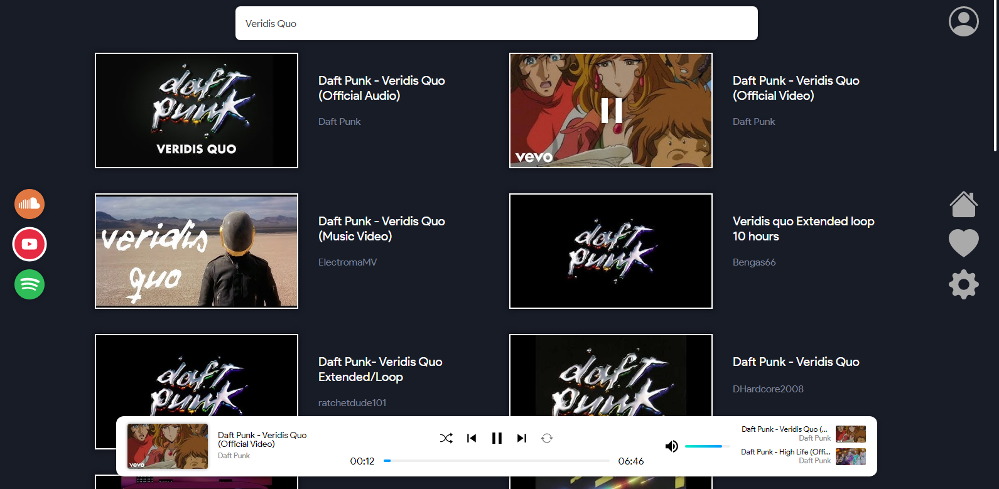
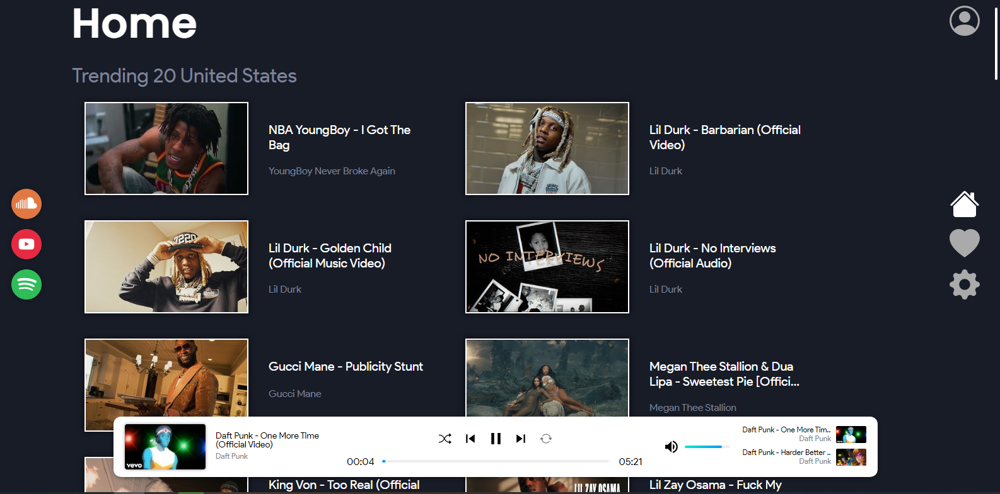
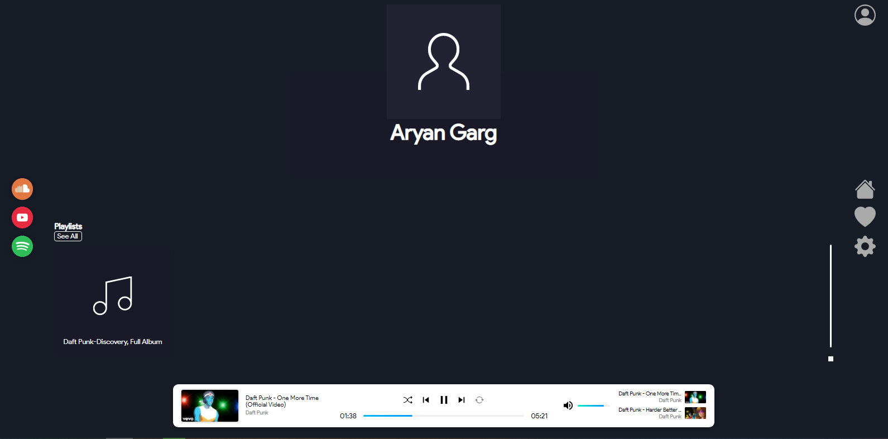

# Ion Player

## What Is IonPlayer?

Ion player was created as a personal project to create a website that can compile
music from Youtube, Spotify, and Soundcloud all in one website.

The website allows a user to import playlists from those websites,
add music from multiple websites all into one playlist, browse music, and play music from those websites.

### View of Playlist Page

### View of Search Page

### View of Home Page

### View of Profile Page

